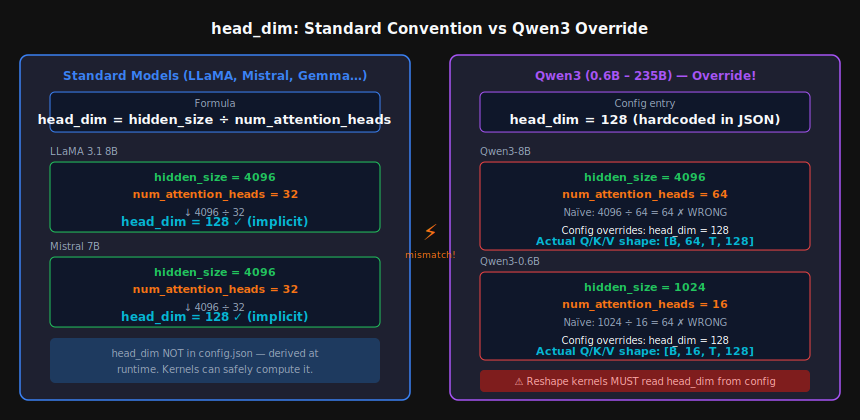
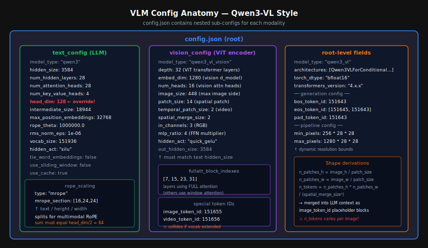

[← Back to Table of Contents](./README.md)

# Appendix C — HuggingFace Model Config Field Reference

> *"A `config.json` is not just metadata — it is the single source of truth for every tensor shape in the model. A misread field propagates silently until your kernel crashes at 3 a.m."*

This appendix is a practitioner's reference for every field you will encounter in a HuggingFace `config.json`. Each entry covers:
- **What it is** and the formula/derivation that depends on it
- **Legal values** and what they imply
- **Caveats & pitfalls** — especially for kernel developers, fine-tuners, and inference engineers

Jump to a section:
- [Quick Reference Table](#quick-reference-table)
- [Core Architecture Parameters](#core-architecture-parameters)
- [Positional Encoding Parameters](#positional-encoding-parameters)
- [Normalization Parameters](#normalization-parameters)
- [Attention Configuration](#attention-configuration)
- [Sliding-Window Attention](#sliding-window-attention)
- [Mixture of Experts](#mixture-of-experts-parameters)
- [Special Token IDs](#special-token-ids)
- [Generation & Runtime](#generation--runtime-parameters)
- [VLM Config — Qwen3-VL and LLaVA Style](#vlm-config--qwen3-vl-and-llava-style)
- [VLA Config — Alpamayo and RT-2 Style](#vla-config--alpamayo-and-rt-2-style)
- [Cross-Model Comparison Table](#cross-model-comparison-table)
- [Kernel Development Pitfall Checklist](#kernel-development-pitfall-checklist)

---

## Quick Reference Table

| Field | Typical type | Example value | Section |
|---|---|---|---|
| `model_type` | string | `"llama"` | [Core Architecture](#model_type--architectures) |
| `architectures` | list[str] | `["LlamaForCausalLM"]` | [Core Architecture](#model_type--architectures) |
| `vocab_size` | int | `128256` | [vocab\_size](#vocab_size) |
| `hidden_size` | int | `4096` | [hidden\_size](#hidden_size) |
| `num_hidden_layers` | int | `32` | [num\_hidden\_layers](#num_hidden_layers) |
| `num_attention_heads` | int | `32` | [num\_attention\_heads](#num_attention_heads) |
| `num_key_value_heads` | int | `8` | [num\_key\_value\_heads](#num_key_value_heads) |
| `head_dim` | int *(optional)* | `128` | [head\_dim ⚠](#head_dim) |
| `intermediate_size` | int | `14336` | [intermediate\_size](#intermediate_size) |
| `hidden_act` | string | `"silu"` | [hidden\_act](#hidden_act) |
| `max_position_embeddings` | int | `131072` | [max\_position\_embeddings](#max_position_embeddings) |
| `rope_theta` | float | `500000.0` | [rope\_theta](#rope_theta) |
| `rope_scaling` | dict *(optional)* | `{"type": "llama3", …}` | [rope\_scaling](#rope_scaling) |
| `rms_norm_eps` | float | `1e-05` | [rms\_norm\_eps](#rms_norm_eps) |
| `layer_norm_eps` | float | `1e-05` | [layer\_norm\_eps](#layer_norm_eps) |
| `attention_bias` | bool | `false` | [attention\_bias](#attention_bias) |
| `mlp_bias` | bool | `false` | [mlp\_bias](#mlp_bias) |
| `attention_dropout` | float | `0.0` | [attention\_dropout](#attention_dropout) |
| `use_sliding_window` | bool | `true` | [Sliding Window](#sliding-window-attention) |
| `sliding_window` | int | `4096` | [Sliding Window](#sliding-window-attention) |
| `max_window_layers` | int | `28` | [Sliding Window](#sliding-window-attention) |
| `tie_word_embeddings` | bool | `false` | [tie\_word\_embeddings](#tie_word_embeddings) |
| `bos_token_id` | int | `1` | [Special Tokens](#special-token-ids) |
| `eos_token_id` | int or list | `2` | [Special Tokens](#special-token-ids) |
| `pad_token_id` | int *(optional)* | `0` | [Special Tokens](#special-token-ids) |
| `use_cache` | bool | `true` | [Generation & Runtime](#use_cache) |
| `torch_dtype` | string | `"bfloat16"` | [Generation & Runtime](#torch_dtype) |
| `num_experts` / `num_local_experts` | int | `64` | [MoE](#mixture-of-experts-parameters) |
| `num_experts_per_tok` | int | `2` | [MoE](#mixture-of-experts-parameters) |
| `router_aux_loss_coef` | float | `0.001` | [MoE](#mixture-of-experts-parameters) |
| `initializer_range` | float | `0.02` | [initializer\_range](#initializer_range) |
| `transformers_version` | string | `"4.46.1"` | [Generation & Runtime](#transformers_version) |

---

## Core Architecture Parameters

### `model_type` / `architectures`

```json
{
  "model_type": "llama",
  "architectures": ["LlamaForCausalLM"]
}
```

`model_type` is a short string key that maps to a registered model class inside the `transformers` source tree. `architectures` lists the full class name(s) that can load this config.

**Legal values for `model_type`:** `"llama"`, `"mistral"`, `"qwen2"`, `"qwen3"`, `"gemma"`, `"gemma2"`, `"phi3"`, `"falcon"`, `"mpt"`, `"bloom"`, `"opt"`, `"gpt_neox"`, `"gpt2"`, `"t5"`, `"bert"`, …

**Pitfalls:**
- The `model_type` string must match exactly what the library registered via `AutoConfig`. A typo silently falls through to a generic fallback class that may load with wrong shapes.
- For custom / community models the field may not exist in the official registry. You must register it manually with `AutoConfig.register` / `AutoModelForCausalLM.register` before `from_pretrained` will work without `trust_remote_code=True`.
- `architectures[0]` is used by the Hub when someone clicks "Use in transformers". If you publish a model with a wrong value the generated snippet breaks.

---

### `vocab_size`

```json
{ "vocab_size": 128256 }
```

Number of tokens in the vocabulary. Sets the size of:
- The **embedding matrix**: $W_e \in \mathbb{R}^{V \times d}$
- The **language-model head**: $W_{\text{lm}} \in \mathbb{R}^{d \times V}$ (or $W_e^\top$ when `tie_word_embeddings=true`)

**Typical ranges:** 32K (older GPT-2 era) → 256K (Qwen2/3 family)

**Pitfalls:**
- The tokenizer's vocabulary size and `vocab_size` in the config **must** agree. When you add special tokens to a tokenizer and call `model.resize_token_embeddings()`, update `config.vocab_size` too — otherwise `from_pretrained` will load correctly but saving/reloading may corrupt the lm head.
- Many kernels pre-allocate logit buffers as `[B, T, vocab_size]`. With vocab sizes of 150K+ (Qwen3: 151,936), this dominates memory at long context. E.g. bfloat16, B=1, T=8192, V=151936 ≈ 2.3 GB just for logits.
- `vocab_size` is sometimes padded to the nearest multiple of 64 or 128 for hardware efficiency (e.g. LLaMA pads to 32,064). The embedding matrix has that padded size, but tokens beyond the real vocabulary should never be produced. This padding breaks naive loop bounds in custom kernels.

---

### `hidden_size`

```json
{ "hidden_size": 4096 }
```

The residual stream dimension $d_{\text{model}}$. Every transformer layer reads and writes to a tensor of shape $[B, T, d_{\text{model}}]$.

**Derived quantities:**
$$d_{\text{model}} = \texttt{hidden\_size}$$
$$W_Q, W_K, W_V \in \mathbb{R}^{d_{\text{model}} \times d_{\text{model}}}$$
$$\text{KV cache per layer} = 2 \cdot B \cdot T \cdot d_{\text{model}} \cdot \text{bytes\_per\_element}$$

**Pitfalls:**
- `hidden_size` does **not** by itself determine head shapes — see [`head_dim`](#head_dim) below.
- Tensor parallelism splits `hidden_size` across GPUs. With `tp=8` and `hidden_size=4096`, each shard sees only 512 channels. Kernels that hard-code `4096` will break.
- When `hidden_size` is not a power of 2 (common in older encoder-only models like BERT-large: 1024), certain CUDA primitives that require power-of-2 tile sizes need guard branches.

---

### `num_hidden_layers`

```json
{ "num_hidden_layers": 32 }
```

Number of transformer decoder blocks $L$. Also called `n_layer` (GPT-2), `num_layers` (Falcon).

**Total parameter contribution:**  
$$P_{\text{attn}} = L \cdot (4 \cdot d^2)  \quad \text{(QKV + output projections, no bias)}$$
$$P_{\text{ffn}} = L \cdot (3 \cdot d \cdot d_{\text{ffn}})  \quad \text{(gate/up/down for SwiGLU)}$$

**Pitfalls:**
- MoE models have the same `num_hidden_layers` but some layers are dense and some are MoE — controlled by `num_experts` and `mlp_type`. Do not assume every layer has the same FLOPs.
- Some architectures (Gemma 2, Mistral) interleave sliding-window and global attention layers. The index of a layer determines which variant is used. Kernels that treat all layers identically will produce wrong outputs.

---

### `num_attention_heads`

```json
{ "num_attention_heads": 32 }
```

Number of query heads $H_Q$ in multi-head attention (MHA) / grouped-query attention (GQA).

**Memory layout (standard):**
$$Q \in \mathbb{R}^{B \times H_Q \times T \times d_{\text{head}}}$$

**Pitfalls:**
- This is the **query head count**, not the KV head count (see `num_key_value_heads`). The KV cache is sized by the latter, not `num_attention_heads`.
- In tensor-parallel setups, `num_attention_heads` must be divisible by `tp_degree`. An odd number of heads (e.g. `num_attention_heads=28` in Qwen3-7B) means `tp=4` is allowed but `tp=3` or `tp=7` is not. Always check divisibility before planning a TP configuration.
- Do **not** use `num_attention_heads` alone to compute `head_dim`. See the dedicated section.

---

### `num_key_value_heads`

```json
{ "num_key_value_heads": 8 }
```

Number of distinct KV heads $H_{KV}$. When $H_{KV} < H_Q$, each KV head is **shared** by $G = H_Q / H_{KV}$ query heads (GQA). When $H_{KV} = 1$ it is MQA.

**KV cache size:**
$$\text{KV cache} = 2 \cdot L \cdot B \cdot T \cdot H_{KV} \cdot d_{\text{head}} \cdot \text{bytes}$$

Example — LLaMA 3.1 8B at T=8192, BF16:
$$2 \times 32 \times 1 \times 8192 \times 8 \times 128 \times 2 = \approx 1.07 \text{ GB}$$

**Pitfalls:**
- Must divide evenly into `num_attention_heads`: $G = H_Q / H_{KV}$ must be an integer. A non-integer ratio causes runtime errors.
- In tensor-parallel setups, `num_key_value_heads` must be ≥ `tp_degree` and divisible by it, OR the framework must replicate the KV heads. vLLM replicates automatically; a custom kernel may not.
- `num_key_value_heads` is absent from older configs (pre-GQA) — treat missing as equal to `num_attention_heads` (MHA).

---

### `head_dim`

```json
{ "head_dim": 128 }
```

> ⚠️ **This is the most common source of silent shape bugs across model families.**

$d_{\text{head}}$ is the per-head dimension. It determines the shape of every Q/K/V tensor and the KV cache.

<div class="diagram">
<div class="diagram-title">head_dim: Standard Convention vs Qwen3 Override</div>


</div>

#### Standard convention (no `head_dim` field in config)

$$d_{\text{head}} = \frac{\texttt{hidden\_size}}{\texttt{num\_attention\_heads}}$$

This is implicit — the field is absent from `config.json` and frameworks compute it at model instantiation time.

| Model | `hidden_size` | `num_attn_heads` | Derived `head_dim` |
|---|---|---|---|
| LLaMA 3.1 8B | 4096 | 32 | **128** |
| Mistral 7B | 4096 | 32 | **128** |
| Gemma 2 9B | 3584 | 16 | **224** |
| Phi-3 Mini | 3072 | 32 | **96** |

#### Qwen3: explicit override

All Qwen3 models set `head_dim: 128` explicitly in `config.json`, regardless of `hidden_size / num_attention_heads`:

| Model | `hidden_size` | `num_attn_heads` | Naïve formula | **Actual `head_dim`** |
|---|---|---|---|---|
| Qwen3-0.6B | 1024 | 16 | 64 | **128** |
| Qwen3-1.7B | 2048 | 16 | 128 | **128** |
| Qwen3-4B | 2560 | 32 | 80 | **128** |
| Qwen3-8B | 4096 | 64 | 64 | **128** |
| Qwen3-14B | 5120 | 40 | 128 | **128** |
| Qwen3-32B | 5120 | 64 | 80 | **128** |
| Qwen3-235B-A22B | 4096 | 64 | 64 | **128** |

The implication: **hidden_size ≠ num_attention_heads × head_dim**. The output projection is still $W_O \in \mathbb{R}^{(H_Q \cdot d_\text{head}) \times d_\text{model}}$, which for Qwen3-8B is $(64 \times 128) \times 4096 = 8192 \times 4096$.

**Pitfalls:**
1. **Kernel reshape bugs.** Flash Attention, custom CUDA, and Triton kernels frequently reshape $[B, T, H \cdot d_h]$ ↔ $[B, H, T, d_h]$. If your kernel assumes $d_h = d_\text{model} / H$, it produces wrong strides silently on Qwen3.
2. **RoPE buffer mismatch.** Sinusoidal positional buffers are pre-computed for `head_dim` frequencies. A buffer computed with `head_dim=64` applied to tensors of `head_dim=128` reads garbage for the upper half.
3. **KV cache pre-allocation.** If you pre-allocate a cache of shape $[L, B, T, H_{KV}, d_h]$ with $d_h$ derived from the formula, Qwen3 cache will be 2× too small on affected model sizes.
4. **Always read `head_dim` from config first; fall back to the formula only if absent.**

```python
# Correct pattern:
head_dim = getattr(config, "head_dim", config.hidden_size // config.num_attention_heads)
```

---

### `intermediate_size`

```json
{ "intermediate_size": 14336 }
```

The inner dimension of the feed-forward (FFN) / MLP block $d_{\text{ffn}}$.

**For SwiGLU (LLaMA/Mistral/Qwen style):**
$$\text{FFN}(x) = \bigl(\sigma(x W_{\text{gate}}) \odot x W_{\text{up}}\bigr) W_{\text{down}}$$
$$W_{\text{gate}}, W_{\text{up}} \in \mathbb{R}^{d \times d_{\text{ffn}}}, \quad W_{\text{down}} \in \mathbb{R}^{d_{\text{ffn}} \times d}$$

**Parameter count per layer:** $3 \cdot d \cdot d_{\text{ffn}}$ (gate, up, down)

**Common ratios** $d_{\text{ffn}} / d$:

| Model family | Ratio | Notes |
|---|---|---|
| LLaMA 3 | ~3.5× | 4096 → 14336 |
| Qwen3 | ~5.3× | 4096 → 21888 (8B) |
| Gemma 2 | ~3.8× | 3584 → 14336 |
| GPT-4 style | 4× | Classic MLP, not SwiGLU |

**Pitfalls:**
- In MoE models each expert has its own `intermediate_size`. Routing logic selects $k$ experts; total activated FFN params = $k \times d \times d_{\text{ffn,expert}}$. The effective ratio is much lower than dense.
- `intermediate_size` is sometimes not a multiple of 64/128. Padding to hardware-friendly sizes in custom kernels must preserve output equivalence.
- Some models list a separate `moe_intermediate_size` (DeepSeek, Qwen2-MoE) for the expert FFNs vs. a shared `intermediate_size` for dense layers.

---

### `hidden_act`

```json
{ "hidden_act": "silu" }
```

The activation function used in the FFN block.

| Value | Formula | Used in |
|---|---|---|
| `"silu"` / `"swish"` | $x \cdot \sigma(x)$ | LLaMA, Mistral, Qwen, Phi |
| `"gelu"` | $x \cdot \Phi(x)$ | BERT, GPT-2, older models |
| `"gelu_new"` | OpenAI tanh approx. | GPT-2 family |
| `"gelu_fast"` | Sigmoid approx. | DistilBERT |
| `"quick_gelu"` | $x \cdot \sigma(1.702 x)$ | CLIP, vision encoders |
| `"relu"` | $\max(0, x)$ | Legacy, rare |
| `"geglu"` | $\text{GELU}(W_g x) \odot W_u x$ | T5 v1.1 |

**Pitfalls:**
- SwiGLU models (using `"silu"`) always have **three** FFN weight matrices (gate, up, down), not two. A kernel written for ReLU-style FFN (two matrices) will silently skip the gate projection.
- `"gelu"` vs `"gelu_new"` produces numerically different outputs. This matters when comparing perplexity across implementations.
- Vision encoders embedded inside VLMs (e.g., Qwen3-VL's ViT) often use `"quick_gelu"` while the language model uses `"silu"`. Make sure you apply the correct activation per sub-model.

---

### `initializer_range`

```json
{ "initializer_range": 0.02 }
```

Standard deviation of the normal distribution used for weight initialization (Xavier/truncated normal).

**Pitfalls:**
- This field only matters at **training start**. If you load pretrained weights, it is ignored. Never tune inference behaviour based on this field.
- When you add new layers to a pretrained model (e.g. adapter modules), you should use this value to initialise new weights consistently.

---

## Positional Encoding Parameters

### `max_position_embeddings`

```json
{ "max_position_embeddings": 131072 }
```

The maximum sequence length the model **was trained** to handle. Sets the size of any learned position embedding table (for models with absolute PE). For RoPE models it is used to pre-compute frequency buffers.

**Pitfalls:**
- This is a **training-time** parameter. At inference you can often go beyond it using RoPE scaling tricks (see `rope_scaling`), but without adjustments, attention scores degrade beyond this length.
- For RoPE models, exceeding `max_position_embeddings` without `rope_scaling` causes positions to wrap (the sinusoidal frequencies were only ever computed for positions 0 → max-1). In practice, perplexity spikes sharply.
- Many models advertise a context window larger than their training context via `rope_scaling`. Always check **both** fields.

---

### `rope_theta`

```json
{ "rope_theta": 500000.0 }
```

The base frequency $\theta$ for Rotary Position Embedding (RoPE). Controls the wavelengths of the sinusoidal position signals:

$$\theta_i = \theta^{-2i/d_{\text{head}}}, \quad i = 0, 1, \ldots, \tfrac{d_{\text{head}}}{2}-1$$

Higher $\theta$ → longer wavelengths → better long-context generalisation.

| Model | `rope_theta` | Context | Notes |
|---|---|---|---|
| LLaMA 2 | 10,000 | 4K | Original |
| LLaMA 3 | 500,000 | 128K | Extended |
| Mistral v0.1 | 10,000 | 8K | Original |
| Qwen3 | 1,000,000 | 32K–131K | Very long |
| DeepSeek-V3 | 10,000 | 128K | Uses YaRN |

**Pitfalls:**
- RoPE buffers (`cos_cache`, `sin_cache`) are pre-computed from `rope_theta`. If you cache these at model load time and then fine-tune with a different `rope_theta`, you must invalidate and recompute the buffers.
- A higher `rope_theta` does NOT automatically enable longer context — you must also increase `max_position_embeddings` and possibly add `rope_scaling`.
- Custom kernels that inline the $\theta_i$ constants lose the ability to adjust for different model families.

---

### `rope_scaling`

```json
{
  "rope_scaling": {
    "factor": 8.0,
    "low_freq_factor": 1.0,
    "high_freq_factor": 4.0,
    "original_max_position_embeddings": 8192,
    "rope_type": "llama3"
  }
}
```

Optional dictionary controlling how RoPE frequencies are scaled to extend context beyond `original_max_position_embeddings`.

**Common types:**

| `rope_type` / `type` | Algorithm | Used in |
|---|---|---|
| `"linear"` | Divide all frequencies by `factor` | Simple extension |
| `"dynamic"` | Scale factor grows with input length | LongRoPE |
| `"llama3"` | Interpolate low-freq, extrapolate high-freq | LLaMA 3 |
| `"yarn"` | NTK + attention temperature correction | Mistral, DeepSeek |
| `"longrope"` | Per-layer scaling factors | Phi-3 128K |
| `"mrope"` | Multi-modal RoPE — splits head_dim into temporal/height/width sections | Qwen3-VL |

**Pitfalls:**
- Every `rope_type` requires different code paths. A kernel that implements only `"linear"` scaling will silently apply wrong positional encodings to LLaMA 3 (`"llama3"`) weights.
- `"mrope"` (Qwen3-VL) splits each head's frequencies into three sections: `mrope_section = [s_t, s_h, s_w]` where $s_t + s_h + s_w = d_{\text{head}}/2$. Applying scalar RoPE to these will corrupt the spatial position encoding of image patches.
- When `rope_scaling` is absent, no scaling is applied; positions beyond `max_position_embeddings` are out-of-distribution.
- LLaMA 3 uses `"llama3"` type with two thresholds (`low_freq_factor`, `high_freq_factor`) that interpolate vs. extrapolate different frequency bands. The exact transition formula is not a simple linear interpolation.

---

## Normalization Parameters

### `rms_norm_eps`

```json
{ "rms_norm_eps": 1e-05 }
```

The epsilon added to the RMS in RMSNorm to prevent division by zero:

$$\text{RMSNorm}(x) = \frac{x}{\sqrt{\frac{1}{d}\sum_i x_i^2 + \epsilon}} \cdot \gamma$$

Used by LLaMA, Mistral, Qwen, Falcon, and most modern models.

**Pitfalls:**
- Default value varies: `1e-5` (LLaMA), `1e-6` (Qwen), `1e-8` (Gemma 2). Using the wrong epsilon in a custom kernel causes numerically different outputs — almost always within floating-point noise, but can accumulate across layers.
- In FP16 mixed-precision training, a too-small epsilon can cause numerical instability. `1e-6` is safer than `1e-8` in FP16.
- Different from `layer_norm_eps` used in LayerNorm (mean-centred).

---

### `layer_norm_eps`

```json
{ "layer_norm_eps": 1e-05 }
```

Epsilon for LayerNorm (as opposed to RMSNorm):

$$\text{LayerNorm}(x) = \frac{x - \mu}{\sqrt{\sigma^2 + \epsilon}} \cdot \gamma + \beta$$

Used by BERT, GPT-2, T5, encoder-only models, and vision encoders inside VLMs.

**Pitfalls:**
- Some VLM models (e.g. LLaVA) have a **vision encoder** with `layer_norm_eps` and a **language decoder** with `rms_norm_eps` at different magnitudes. Mixing them produces subtle accuracy loss.
- Certain models use both fields (the config has `rms_norm_eps` for transformer blocks and `layer_norm_eps` for adapters / projection layers).

---

## Attention Configuration

### `attention_bias`

```json
{ "attention_bias": false }
```

Whether the Q, K, V, and output projection matrices include a bias term.

| Value | Memory impact | Used in |
|---|---|---|
| `false` | No extra params | LLaMA, Mistral, Qwen (most modern) |
| `true` | +4 × d per layer | GPT-2, older BERT-style, Falcon |

**Pitfalls:**
- A kernel that skips the bias term when `attention_bias=true` produces incorrect outputs. This is especially insidious with models that have bias only on certain projections (Falcon has bias on QKV but not output).
- Some models have a separate `qkv_bias` field (Qwen2-VL, CLIP ViT). Check the model class source if unsure.

---

### `mlp_bias`

```json
{ "mlp_bias": false }
```

Whether the FFN projections (gate, up, down) include bias. Almost always `false` in modern models.

**Pitfalls:**
- Same as `attention_bias` — missing a bias addition shifts outputs.
- Phi-3 includes biases in QKV but not FFN (`attention_bias=false` in some versions). Always check the config, never assume.

---

### `attention_dropout`

```json
{ "attention_dropout": 0.0 }
```

Dropout probability applied to attention weights during **training**. At inference this is always 0 regardless of the field.

**Pitfalls:**
- This is only active when `model.train()` mode is set. If your inference code accidentally leaves the model in train mode, attention dropout fires and produces stochastic (non-deterministic) outputs.
- Flash Attention passes `dropout_p` as a float; always pass `0.0` at inference even if the config has a non-zero value — check whether your inference wrapper does this correctly.

---

## Sliding-Window Attention

```json
{
  "use_sliding_window": true,
  "sliding_window": 4096,
  "max_window_layers": 28
}
```

Some models (Mistral, Qwen2/3, Gemma 2) use a mix of **local sliding-window attention** (SWA) and **global attention** layers.

| Field | Meaning |
|---|---|
| `use_sliding_window` | Whether SWA is enabled at all |
| `sliding_window` | Number of tokens in the local window ($w$) |
| `max_window_layers` | Layers **above** this index use full global attention |

**How it works:**

```
Layers 0 … max_window_layers-1 :  SWA, window = sliding_window
Layers max_window_layers … L-1 :  Full attention
```

**Memory formula (SWA layers):**

$$\text{KV cache (SWA)} = 2 \cdot L_{\text{SWA}} \cdot B \cdot w \cdot H_{KV} \cdot d_h \cdot \text{bytes}$$

**Pitfalls:**
- A kernel implementing only full attention and applied to an SWA model will produce **correct but suboptimal** outputs (the model still works because SWA is a subset of full attention, but memory usage explodes).
- Applying SWA to a model without it (or vice versa) silently produces wrong outputs. Always gate on `use_sliding_window`.
- **Gemma 2 interleaves**: every other layer alternates SWA/global. `max_window_layers` doesn't apply; check the model source for the interleaving logic.
- During KV cache eviction/paging (PagedAttention), the eviction policy differs for SWA layers — you can evict tokens outside the window freely. A paging system unaware of `sliding_window` may under-evict.

---

## Mixture of Experts Parameters

```json
{
  "num_local_experts": 64,
  "num_experts_per_tok": 6,
  "router_aux_loss_coef": 0.001,
  "num_shared_experts": 2
}
```

Field naming is inconsistent across model families:

| Field name | Alternatives | Meaning |
|---|---|---|
| `num_local_experts` | `num_experts`, `moe_num_experts` | Total experts per MoE layer |
| `num_experts_per_tok` | `top_k`, `num_selected_experts` | Experts activated per token |
| `router_aux_loss_coef` | `aux_loss_alpha` | Load balancing loss weight |
| `num_shared_experts` | — | Always-active experts (DeepSeek) |
| `first_k_dense_replace` | `num_dense_layers` | How many leading layers are dense (not MoE) |
| `moe_layer_freq` | — | Every $n$-th layer is MoE (some configs) |

**Formulae:**

$$\text{Active params per token} = P_{\text{dense}} + k \cdot P_{\text{expert}}$$
$$\text{Total params} = P_{\text{dense}} + N_e \cdot P_{\text{expert}}$$

**Pitfalls:**
- `num_experts_per_tok` * `num_local_experts` routing logits are computed for every token. Kernels that pre-allocate expert buffers assuming all experts are active will allocate $N_e / k$ times too much memory.
- Load balancing: if `router_aux_loss_coef` is absent or 0 at training, experts will not be balanced, causing inference throughput collapse on certain tokens.
- `num_shared_experts` (DeepSeek-V3, Qwen2-MoE) refers to experts that are always active alongside the top-k selected experts. These must be summed into the active parameter count. Missing them underestimates FLOPs by ~20%.
- Expert weights are usually stored contiguously for efficient dispatch. Custom kernels must match the layout expected by the routing code.

---

## Special Token IDs

```json
{
  "bos_token_id": 1,
  "eos_token_id": [2, 128009],
  "pad_token_id": 0
}
```

| Field | Role |
|---|---|
| `bos_token_id` | Prepended to every sequence (beginning of sentence) |
| `eos_token_id` | Signals end of generation; can be a list of valid stop tokens |
| `pad_token_id` | Used to pad shorter sequences in a batch |

**Pitfalls:**
- `eos_token_id` can be a **list** (LLaMA 3: `[128001, 128008, 128009]`). A generation loop that only checks equality to a single integer will not stop on alternate EOS tokens, causing runaway generation.
- When `pad_token_id` is unset (null/absent) and you run batched inference, HuggingFace defaults to `eos_token_id`. This means padded positions will receive the EOS token — which is often fine for inference but can corrupt training batches if not masked.
- For Qwen3/ChatML models, the BOS token is the same as the `<|im_start|>` token. Omitting it causes the model to lose the chat template structure.
- KV cache implementations that detect EOS and stop early must check against the full list, not just index 0.

---

## Generation & Runtime Parameters

### `use_cache`

```json
{ "use_cache": true }
```

Whether to return and use past key-value states (the KV cache) during generation. Should be `true` for inference, `false` during training (saves memory, avoids caching overhead during forward-only passes).

**Pitfalls:**
- Leaving `use_cache=true` during training wastes memory; disabling it at inference causes $O(T^2)$ computation per step instead of $O(T)$.
- Gradient checkpointing (`use_reentrant=True`) is incompatible with `use_cache=True` in some model classes. If you see recomputation errors, disable caching.

---

### `torch_dtype`

```json
{ "torch_dtype": "bfloat16" }
```

Preferred weight dtype. Informational — `from_pretrained` uses this as default but it can be overridden.

| Value | Range | Notes |
|---|---|---|
| `"float32"` | ±3.4×10³⁸ | Default; safe but 2× memory |
| `"bfloat16"` | ±3.4×10³⁸ | Modern standard; same range as FP32 |
| `"float16"` | ±65504 | Overflow risk with large logits/activations |
| `"float8_e4m3fn"` | — | Emerging; requires explicit handling |

**Pitfalls:**
- FP16 overflows when logits or hidden states grow large. BF16 is strictly preferred for transformer training/inference. If you load a BF16 model in FP16 and the model has large embeddings (vocab_size > 100K), you may see NaNs in the logit layer.
- `torch_dtype` in config does **not** enforce the dtype at `from_pretrained` time unless you pass `torch_dtype="auto"`.

---

### `transformers_version`

```json
{ "transformers_version": "4.46.1" }
```

The library version used when the model was saved.

**Pitfalls:**
- A model saved with transformers 4.46 may not load correctly under 4.40 if it uses a feature added in-between (e.g. Qwen3's `head_dim` field was added in a later version). Always use ≥ the saved version.
- The config schema is not versioned separately from the library. Breaking changes land silently.

---

### `tie_word_embeddings`

```json
{ "tie_word_embeddings": false }
```

When `true`, the input embedding matrix $W_e$ and the LM head $W_{\text{lm}}$ share the same tensor.

**Parameter savings:**  
$$\text{saved} = V \times d_{\text{model}} \times \text{bytes}$$

For LLaMA-3 8B: $128256 \times 4096 \times 2 \approx 1$ GB saved.

**Pitfalls:**
- With `tie_word_embeddings=true`, optimizers maintain a single set of gradients for the shared matrix. If you apply separate learning rates to embeddings vs. head, the effective LR is the sum — usually unintentional.
- When quantising, tying embeddings means quantising the embedding table also quantises the LM head. INT8 embeddings are fine; INT4 LM heads cause significant quality loss. Most quantisation libraries detect and skip tying for INT4.
- If you `resize_token_embeddings()` but the config still has `tie_word_embeddings=true`, you must call it on the model (not just the weight), otherwise the two tensors fall out of sync.

---

## VLM Config — Qwen3-VL and LLaVA Style

Vision-Language Models nest multiple sub-configs inside a single `config.json`. Understanding this structure is essential for both loading and kernel development.

<div class="diagram">
<div class="diagram-title">VLM Config Anatomy — Qwen3-VL Style</div>


</div>

### General VLM Config Structure

```json
{
  "model_type": "qwen3_vl",
  "architectures": ["Qwen3VLForConditionalGeneration"],
  "text_config": { ... },
  "vision_config": { ... },
  "image_token_id": 151655,
  "video_token_id": 151656,
  "min_pixels": 200704,
  "max_pixels": 1003520
}
```

A VLM config has:
1. **Root-level fields** — model type, special tokens shared across modalities
2. **`text_config`** — the language model config (same fields as a standalone LLM)
3. **`vision_config`** — the visual encoder config

The `text_config.head_dim` caveat applies identically inside VLMs. Qwen3-VL-7B has `text_config.head_dim = 128` with `text_config.num_attention_heads = 28` and `text_config.hidden_size = 3584`, giving naïve head_dim = 128 ≈ correct only by coincidence for this size.

---

### Vision Config Fields (Qwen3-VL / ViT-style)

| Field | Typical value | Meaning | Pitfalls |
|---|---|---|---|
| `depth` | 32 | Number of ViT transformer layers | Different from LLM's `num_hidden_layers` — do not confuse |
| `embed_dim` | 1280 | Vision hidden size $d_\text{vis}$ | Must be projected to `text_config.hidden_size` via a connector |
| `num_heads` | 16 | Vision attention heads | head_dim = embed_dim / num_heads (standard convention here, no override) |
| `image_size` | 448 | Max input image side length | Dynamic resolution: actual size varies; this is just an upper bound |
| `patch_size` | 14 | Spatial patch size in pixels | Must divide evenly into image dimensions after padding |
| `temporal_patch_size` | 2 | Video frame patch grouping | Pairs of frames → single temporal token; odd frame counts need padding |
| `spatial_merge_size` | 2 | Spatial pooling factor after encoding | Reduces token count by `merge_size²`; affects the number of image tokens in the LLM context |
| `in_channels` | 3 | Input image channels (RGB) | Some models support depth (4 channels) or infrared; changing this requires re-training |
| `mlp_ratio` | 4 | FFN expansion in ViT | d_ffn = embed_dim × mlp_ratio = 5120 |
| `hidden_act` | `"quick_gelu"` | ViT activation | Different from LLM activation (silu)! |
| `out_hidden_size` | 3584 | Projection output size | Must equal `text_config.hidden_size` |
| `fullatt_block_indexes` | `[7,15,23,31]` | ViT layers using full attention | Other layers use window attention — affects memory |

#### Image Tokenisation Formula

$$N_\text{patches} = \frac{H}{p} \cdot \frac{W}{p}$$

$$N_\text{tokens} = \frac{N_\text{patches}}{m^2} = \frac{H \cdot W}{p^2 \cdot m^2}$$

where $p$ = `patch_size`, $m$ = `spatial_merge_size`.

For a 448×448 image with $p=14$, $m=2$:
$$N_\text{tokens} = \frac{448 \times 448}{14^2 \times 4} = \frac{200704}{784} = 256$$

For a 1024×1024 image:
$$N_\text{tokens} = \frac{1024 \times 1024}{784} \approx 1337$$

**Pitfalls (Vision Config):**

1. **Dynamic resolution.** Unlike text (fixed vocabulary), image token count varies per image. Pre-allocating a fixed KV cache for image tokens will break when a large image produces more tokens than expected.
2. **Connector shape mismatch.** The projection MLP connecting the ViT to the LLM takes `embed_dim` as input and outputs `text_config.hidden_size`. A shape error here is common when mixing different ViT and LLM sizes.
3. **`fullatt_block_indexes` must be honoured.** ViT layers not in this list use window attention. Applying full attention everywhere is functionally correct but wastes memory; applying window attention to full-attention layers corrupts quality.
4. **Temporal patch size and video.** For video input, frames are grouped into pairs (`temporal_patch_size=2`). An odd number of frames must be handled (usually by duplicating the last frame). Missing this causes a shape error in the patching step.
5. **`image_token_id` and `video_token_id` occupy specific positions in the vocabulary.** These IDs must not collide with BOS/EOS or pad tokens. When extending the vocabulary for a new language, verify there are no collisions.
6. **`min_pixels` / `max_pixels`** constrain the dynamic resolution selection. The processor will resize/tile the image to satisfy these bounds. Setting `max_pixels` too low degrades OCR quality; too high inflates context length. These live at the root level, not inside `vision_config`.

---

### LLaVA / LLaVA-Next Style VLM Config

```json
{
  "model_type": "llava",
  "vision_config": {
    "model_type": "clip_vision_model",
    "hidden_size": 1024,
    "intermediate_size": 4096,
    "num_hidden_layers": 24,
    "num_attention_heads": 16,
    "image_size": 336,
    "patch_size": 14
  },
  "text_config": { "model_type": "llama", ... },
  "projector_hidden_act": "gelu",
  "vision_feature_layer": -2,
  "vision_feature_select_strategy": "default",
  "image_grid_pinpoints": [[336, 672], [672, 336], [672, 672], [1008, 336], [336, 1008]]
}
```

| Field | Meaning | Pitfalls |
|---|---|---|
| `vision_feature_layer` | Which ViT layer's output to use | `-2` means penultimate; `-1` is the final CLS-normalised output; mixing these changes the feature distribution |
| `vision_feature_select_strategy` | `"default"` (patch tokens only) or `"full"` (patch + CLS) | `"full"` adds 1 extra token per image |
| `projector_hidden_act` | Activation in the MLP projector | `"gelu"` is common; using the wrong one mismatches pretrained projector weights |
| `image_grid_pinpoints` | Allowed tiled resolutions for high-res images | LLaVA-Next divides the image into multiple tiles; the number of image tokens = tiles × patches_per_tile |

---

## VLA Config — Alpamayo and RT-2 Style

Vision-Language-Action (VLA) models extend VLMs with action prediction. Their configs add fields controlling the **action space**, **observation modalities**, and **temporal dynamics**.

### What Makes a VLA Different

```
Input:  [image tokens | text/instruction tokens | state tokens]
Output: [text tokens | action tokens]
```

Action tokens may be discrete (tokenised from the continuous action space via binning) or continuous (predicted via a regression head).

### Alpamayo-Style Config Fields

```json
{
  "model_type": "alpamayo",
  "architectures": ["AlpamayoForConditionalGeneration"],
  "text_config": { ... },
  "vision_config": { ... },
  "action_config": {
    "action_dim": 7,
    "action_chunk_size": 16,
    "action_vocab_size": 256,
    "action_token_offset": 152064,
    "num_action_layers": 4,
    "action_hidden_size": 512,
    "control_frequency_hz": 50,
    "state_dim": 14,
    "state_token_id": 151657
  }
}
```

| Field | Meaning | Pitfalls |
|---|---|---|
| `action_dim` | Degrees of freedom of the action (e.g. 7 = 6-DoF arm + gripper) | Must match the robot's URDF/API. A mismatch crashes the control loop silently (motor ignores extra dims) |
| `action_chunk_size` | Number of future timesteps predicted at once | Higher = smoother but higher latency per inference call; must align with the trajectory rollout buffer |
| `action_vocab_size` | Number of discrete bins per action dimension | Finer bins → higher resolution but more tokens; vocab must fit within `text_config.vocab_size` allocated range |
| `action_token_offset` | First ID in the vocabulary reserved for action tokens | Must not overlap with text/image tokens; validate against `vocab_size` |
| `num_action_layers` | Dedicated action-decoding transformer layers appended after the base LLM | Additional memory per inference; must be allocated separately from LLM KV cache |
| `action_hidden_size` | Hidden size of the action decoder | May differ from `text_config.hidden_size`; requires a projection bridge |
| `control_frequency_hz` | Robot control loop frequency | Inference latency must be < 1/frequency. E.g. 50 Hz → < 20 ms per inference. Batch size must be 1 |
| `state_dim` | Proprioceptive state vector dimension (joint angles, velocities, etc.) | Usually normalised per-dataset; normalisation stats are NOT stored in config.json — they live in a separate stats file |
| `state_token_id` | Special token marking the proprioceptive state in the sequence | Must not collide with `image_token_id` or `video_token_id` |

### RT-2 / OpenVLA Style Notes

RT-2 (and OpenVLA which is based on LLaVA) discretises actions differently:

```json
{
  "norm_stats": {
    "action": {
      "mean": [...],
      "std": [...],
      "q01": [...],
      "q99": [...]
    }
  }
}
```

**Key distinction from Alpamayo:**
- Actions are tokenised as text tokens (e.g. bin indices formatted as strings)
- The action vocabulary is carved out from the **top** of the existing text vocabulary: `action_token_id[i] = vocab_size - (action_vocab_size * action_dim) + i`
- No separate `action_config` block — actions are treated as structured text

**Pitfalls (VLA):**

1. **Action normalisation stats are separate.** `config.json` does not store the per-dataset action mean/std. If you load a VLA for a different robot without updating normalisation stats, the predicted actions are physically wrong even if the model runs without error.
2. **Control frequency vs. inference budget.** At 50 Hz you have 20 ms. Typical 7B VLMs take 30–100 ms on a single A100. VLAs run smaller LLM backbones (3B–7B) and quantise aggressively for real-time use.
3. **Action chunking increases latency but reduces jitter.** `action_chunk_size=16` means you run inference every 16 timesteps at `1/(16 × control_frequency_hz)` call frequency. The robot executes pre-planned chunks; latency spikes between chunks cause jerky motion.
4. **State dim normalisation must match the training distribution.** Reusing a VLA on a robot with different joint limits without renormalising will produce poor actions even if the policy is otherwise applicable.
5. **Token collision.** If `action_token_offset + action_vocab_size * action_dim > vocab_size`, action tokens collide with the EOS/BOS region. This is not validated at load time.
6. **Batch size must be 1 at inference** for real-robot deployment (each inference is tied to the current observation state). VLAs are not meant for batched generation.

---

## Cross-Model Comparison Table

| Param | LLaMA 3.1 8B | Mistral 7B v0.3 | Qwen3-8B | Gemma 2 9B | DeepSeek-V3 (MoE) | Qwen3-VL-7B (LLM part) |
|---|---|---|---|---|---|---|
| `hidden_size` | 4096 | 4096 | 4096 | 3584 | 7168 | 3584 |
| `num_hidden_layers` | 32 | 32 | 36 | 42 | 61 | 28 |
| `num_attention_heads` | 32 | 32 | 64 | 16 | 128 | 28 |
| `num_key_value_heads` | 8 | 8 | 8 | 8 | 128 | 4 |
| `head_dim` | *(implicit 128)* | *(implicit 128)* | **128 ← override** | 256 | 128 | *(implicit 128)* |
| `intermediate_size` | 14336 | 14336 | 22016 | 14336 | 18432 | 18944 |
| `rope_theta` | 500,000 | 1,000,000 | 1,000,000 | 10,000 | 10,000 | 1,000,000 |
| `vocab_size` | 128,256 | 32,768 | 151,936 | 256,000 | 129,280 | 151,936 |
| `rms_norm_eps` | 1e-5 | 1e-5 | 1e-6 | 1e-6 | 1e-6 | 1e-6 |
| `sliding_window` | — | 4096 | — | 4096 (odd) | — | — |
| `num_local_experts` | — | — | — | — | 256 | — |
| `num_experts_per_tok` | — | — | — | — | 8 | — |
| `tie_word_embeddings` | false | false | false | true | false | false |

---

## Kernel Development Pitfall Checklist

Use this checklist when writing or porting a CUDA/Triton kernel for a new model family:

- [ ] **head_dim**: Always read from `config.head_dim` if present; fall back to `hidden_size // num_attention_heads`. Never hard-code.
- [ ] **GQA reshape**: KV head expansion ($H_Q / H_{KV}$ repetitions) must use `num_key_value_heads`, not `num_attention_heads`.
- [ ] **RoPE type**: Check `rope_scaling.type`/`rope_type` field. Implement all types your model family uses, or assert on unsupported types.
- [ ] **mrope sections**: For VLMs with `rope_type = "mrope"`, frequencies are split per modality dimension — apply per-section frequencies, not a uniform vector.
- [ ] **Sliding window**: Check `use_sliding_window` per layer index vs `max_window_layers`. Gemma 2 uses interleaved pattern (not threshold-based).
- [ ] **Activation function**: SwiGLU uses three weight matrices. Check `hidden_act` before assuming two-matrix FFN.
- [ ] **MoE layer type**: Not all layers are MoE. Use `first_k_dense_replace` / `moe_layer_freq` to determine which layers have expert routing.
- [ ] **vocab_size padding**: Embedding tables may be padded beyond actual vocabulary. Mask logits beyond true vocab_size before sampling.
- [ ] **Special token collisions**: For VLMs/VLAs, verify `image_token_id`, `video_token_id`, `state_token_id` are all within `vocab_size` and non-overlapping.
- [ ] **Dynamic image token count**: Never pre-allocate a fixed number of image tokens per image. Compute dynamically from the formula $N = H \cdot W / (p^2 \cdot m^2)$.
- [ ] **EOS as list**: Generation stop condition must check all IDs in `eos_token_id` (can be a list).
- [ ] **dtype mismatch**: Ensure KV cache dtype matches `torch_dtype`. BF16 cache with FP32 accumulation is intentional (flash attention); FP16 cache with BF16 activations is not.
- [ ] **Tensor-parallel divisibility**: Verify `num_attention_heads % tp_degree == 0` and `num_key_value_heads >= tp_degree` or that KV heads will be replicated.

---

[← Previous: Appendix B — Tokenization Deep Dive](./appendix_b_tokenization.md)

---

*Last updated: April 2026*
